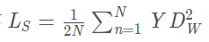

# 辨别式学习相似度量，应用于人脸识别

该方法的理念是学习一个将输入模式映射到目标空间的函数，从而使目标空间中的规范近似于输入空间中的 "语义 "距离。

孪生网络（Siamese network）是一种网络结构，通过一个NN将样本的维度降低到某个较低的维度。

在低维空间，任意两个样本：

- 如果它们是相同类别，空间距离尽量接近0
- 如果它们是不同类别，空间距离大于某个间隔

## 1.Siamese背景

Siamese和Chinese有点像。Siam是古时候泰国的称呼，中文译作暹罗。Siamese也就是“暹罗”人或“泰国”人。Siamese在英语中是“孪生”、“连体”的意思，这是为什么呢？

十九世纪泰国出生了一对连体婴儿，当时的医学技术无法使两人分离出来，于是两人顽强地生活了一生，1829年被英国商人发现，进入马戏团，在全世界各地表演，1839年他们访问美国北卡罗莱那州后来成为“玲玲马戏团” 的台柱，最后成为美国公民。1843年4月13日跟英国一对姐妹结婚，恩生了10个小孩，昌生了12个，姐妹吵架时，兄弟就要轮流到每个老婆家住三天。1874年恩因肺病去世，另一位不久也去世，两人均于63岁离开人间。两人的肝至今仍保存在费城的马特博物馆内。从此之后“暹罗双胞胎”（Siamesetwins）就成了连体人的代名词，也因为这对双胞胎让全世界都重视到这项特殊疾病。

简单来说，Siamese network就是“连体的神经网络”

- 要解决什么问题？

  - 第一类，分类数量较少，每一类的数据量较多，比如ImageNet、VOC等。这种分类问题可以使用神经网络或者SVM解决，只要事先知道了所有的类。
  - 第二类，分类数量较多（或者说无法确认具体数量），每一类的数据量较少，比如人脸识别、人脸验证任务

- 用了什么方法解决？

  - 提出了一种思路：将输入映射为一个向量，比较向量之间的“距离”来判断两个输入之间的“分类”。
  - 基于上述思路设计了 Siamese Network，每次输入两个样本计算损失函数。
    - 常用的softmax只需输入一个样本就能计算对应的损失函数。
    - 人脸识别中的 triplet loss，一次需要输入三个样本才能计算损失函数。
  - 提出了 Constrastive Loss 用于训练。

- 效果如何？

  - 本论文效果怎么样我不清楚，但在参加的kaggle竞赛中，排名第一的大佬（精度比第二名高了10个点……）就用了 Siamese Network 结构。

- 还存在什么问题？

  - 2008年的论文了……就看个思路，一部分细节已经没有什么价值了

    

- 应用的场景

  孪生神经网络用于处理两个输入"比较类似"的情况。伪孪生神经网络适用于处理两个输入"有一定差别"的情况。比如，我们要计算两个句子或者词汇的语义相似度，使用siamese network比较适合；如果验证标题与正文的描述是否一致（标题和正文长度差别很大），或者文字是否描述了一幅图片（一个是图片，一个是文字），就应该使用pseudo-siamese network。也就是说，要根据具体的应用，判断应该使用哪一种结构，哪一种Loss。

- Siamese的创新

  这个网络主要的优点是淡化了标签，使得网络具有很好的扩展性，可以对那些没有训练过的类别进行分类，这点是优于很多算法的。而且这个算法对一些小数据量的数据集也适用，变相的增加了整个数据集的大小，使得数据量相对较小的数据集也能用深度网络训练出不错的效果。

  

## **2. 模型思路**

### **2.1. 问题的提出与解决方案**

- 分类问题：
  - 一：分类数量较少，每一类的样本数量较多，如ImageNet、VOC等数据集。
  - 二：分类数量较多（或无法确定具体数量），每一类样本数量较少，如人脸识别任务。
- 常用解决方案（普通图像分类模型，如VGG, ResNet等）：常用于解决第一类分类问题。对第二类分类问题效果不佳。
- Metric Learning：
  - 总体思路：将输入数据经过模型转换为一个向量，比较不同向量间的“距离”来判断不同输入数据之间的关系，构建损失函数。
  - 不同向量间的“距离”指的是什么？
    - 可以参考：[CSDN文章 - 向量空间中各类距离的意义](https://link.zhihu.com/?target=https%3A//blog.csdn.net/tagst/article/details/50214669)。
  - 联想：感觉跟NLP中的 word2vec 一个思路。

### **2.2. 数学符号描述**

- 输入数据：`X_1, X_2, X_2'`，其中`X_1, X_2`属于同一类别，`X_2'`与`X_1, X_2`属于不同类别。
- 模型`G_W`：其中`W`就是该模型的参数，而`G_W(X)`的功能就是将输入数据`X`转换为一组向量。
- 距离`E_W(X_1, X_2)`：用于描述两个输入数据转换为向量后，两个向量之间的距离。
  - 假设使用L1距离，则`E_W(X_1, X_2) = ||G_W(X_1) - G_W(X_2)||`

### **2.3. 论文截图**

- 不同输入`X_1, X_2`通过统一`G_W`得到两个向量`G_W(X_1), G_W(X_2)`，计算两个向量之间的L1距离获得`E_W`。
- 

不同输入X_1, X_2通过统一G_W得到两个向量G_W(X_1), G_W(X_2)，计算两个向量之间的L1距离获得E_W。

其中，两个network是两个共享权值的网络，实际上就是两个完全相同的网络。孪生神经网络有两个输入（X1 and X2）,将两个输入feed进入两个神经网络（Network1 and Network2），这两个神经网络分别将输入映射到新的空间，形成输入在新的空间中的表示。通过Loss的计算，评价两个输入的相似度。

如果左右两边不共享权值，而是两个不同的神经网络，叫做pseudo-siamese network，伪孪生神经网络。对于pseudo-siamese network，两边可以是不同的神经网络（如一个是lstm，一个是cnn），也可以是相同类型的神经网络。

目的：比较两幅图片是否相似，或者说相似度是多少【匹配度】

输入：两幅图片

输出：一个相似度数值

Network1和Network2两个神经网络的权重一样，甚至可以两者是同一个网络，不用实现另外一个，因为权值都一样。对于siamese network，两边可以是lstm或者cnn，都可以

------

## **3. 论文中Contrastive Loss 损失函数设计**

### 损失函数的选择

Softmax当然是一种好的选择，但不一定是最优选择，即使是在分类问题中。传统的siamese network使用Contrastive Loss。损失函数还有更多的选择，siamese network的初衷是计算两个输入的相似度,。左右两个神经网络分别将输入转换成一个"向量"，在新的空间中，通过判断cosine距离就能得到相似度了。Cosine是一个选择，exp function也是一种选择，欧式距离什么的都可以，训练的目标是让两个相似的输入距离尽可能的小，两个不同类别的输入距离尽可能的大。

- 损失函数定义如下：

  - `Y`代表`X_1, X_2`是否属于同一类别。输入同一类别为0，不属于同一类别为1。

  - `P`代表输入数据数量。

  - `i`表示当前输入数据下标。

  - `L_G`代表两个输入数据属于同一类别时的损失函数（G，genuine）。

  - `L_I`代表两个输入数据不属于同一类别的损失函数（I，imposter）。

    

### Contrastive Loss 基本定义

- 根据我们对两个向量间举例的定义，可以得到以下条件：

  - 即不同类别向量间的距离 比 相同类别向量间距离 大。

  - 两个向量之间距离越小，属于同一类别的可能性就越大。

    

条件1

- 其他：

  - 目标：优化`L`时（L减小时），相同类别的`E_W`取值越来越小，不同类别的`E_W`的取值越来越大。

  - 最重要的就是如何设计`L_G`和`L_I`函数。

  - 论文中的定义如下，但好像现在都不用了。

    

### **目前的Contrastive Loss:**

其中：

代表两个样本特征X1和X2 的欧氏距离（二范数）P 表示样本的特征维数，Y 为两个样本是否匹配的标签，Y=1 代表两个样本相似或者匹配，Y=0 则代表不匹配，m 为设定的阈值，N 为样本个数。

观察上述的contrastive loss的表达式可以发现，这种损失函数可以很好的表达成对样本的匹配程度，也能够很好用于训练提取特征的模型。

当 Y=1（即样本相似时），损失函数只剩下

即当样本不相似时，其特征空间的欧式距离反而小的话，损失值会变大，这也正好符号我们的要求。

当 Y=0 (即样本不相似时），损失函数为

即当样本不相似时，其特征空间的欧式距离反而小的话，损失值会变大，这也正好符号我们的要求。

注意：

这里设置了一个阈值ｍargin，表示我们只考虑不相似特征欧式距离在０～ｍargin之间的，当距离超过ｍargin的，则把其loss看做为０(即不相似的特征离的很远，其loss应该是很低的；而对于相似的特征反而离的很远，我们就需要增加其loss，从而不断更新成对样本的匹配程度)

### 论文中损失函数定义

- 当我以 `Contrastive Loss` 查找资料时，定义如下（参考[这里](https://link.zhihu.com/?target=https%3A//blog.csdn.net/autocyz/article/details/53149760)）：
  - 其中d表示两个向量间的距离。
  - caffe中存在`constrastive loss`就是这么定义的。

## **4、伪孪生神经网络：**

如果左右两边不共享权值，而是两个不同的神经网络，则模型叫pseudo-siamese network，伪孪生神经网络，如下图所示。对于pseudo-siamese network，两边可以是不同的神经网络（如一个是lstm，一个是cnn），也可以是相同类型的神经网络。

 

## 5、孪生神经网络的用途：衡量两个输入的相似程度

孪生神经网络有两个输入（Input1 and Input2）,将两个输入feed进入两个神经网络（Network1 and Network2），这两个神经网络分别将输入映射到新的空间，形成输入在新的空间中的表示。通过Loss的计算，评价两个输入的相似度。

用途：

- 词汇的语义相似度分析，QA中question和answer的匹配，签名/人脸验证。
- 手写体识别也可以用siamese network，网上已有github代码。
- 还有kaggle上Quora的question pair的比赛，即判断两个提问是不是同一问题，冠军队伍用的就是n多特征+Siamese network，知乎团队也可以拿这个模型去把玩一下。
- 在图像上，基于Siamese网络的视觉跟踪算法也已经成为热点《[Fully-convolutional siamese networks for object tracking](https://link.jianshu.com/?t=https%3A%2F%2Flink.springer.com%2Fchapter%2F10.1007%2F978-3-319-48881-3_56)》。

## 6、孪生神经网络和伪孪生神经网络分别适用于什么场景呢

先上结论：孪生神经网络用于处理两个输入"比较类似"的情况。伪孪生神经网络适用于处理两个输入"有一定差别"的情况。比如，我们要计算两个句子或者词汇的语义相似度，使用siamese network比较适合；如果验证标题与正文的描述是否一致（标题和正文长度差别很大），或者文字是否描述了一幅图片（一个是图片，一个是文字），就应该使用pseudo-siamese network。也就是说，要根据具体的应用，判断应该使用哪一种结构，哪一种Loss。

## 7、Siamese network 的损失函数

Softmax当然是一种好的选择，但不一定是最优选择，即使是在分类问题中。【分类问题用交叉熵】

传统的siamese network使用Contrastive Loss【对比损失函数】。

**对比损失函数**如下：

- 其中Dw被定义为姐妹孪生网络的输出之间的欧氏距离。Dw欧式距离公式如下：

- 其中Gw是其中一个姐妹网络的输出。X1和X2是输入数据对。
- Y值为1或0。如果模型预测输入是相似的，那么Y的值为0，否则Y为1。
- max（）是表示0和m-Dw之间较大值的函数。
- m是大于0的边际价值（margin value）。有一个边际价值表示超出该边际价值的不同对不会造成损失。这是有道理的，因为你只希望基于实际不相似对来优化网络，但网络认为是相当相似的。

 

【损失函数还有更多的选择，siamese network的初衷是计算两个输入的相似度,。左右两个神经网络分别将输入转换成一个"向量"，在新的空间中，通过判断cosine距离就能得到相似度了。Cosine是一个选择，exp function也是一种选择，欧式距离什么的都可以，训练的目标是让两个相似的输入距离尽可能的小，两个不同类别的输入距离尽可能的大。其他的距离度量没有太多经验，这里简单说一下cosine和exp在NLP中的区别。

根据实验分析，cosine更适用于词汇级别的语义相似度度量，而exp更适用于句子级别、段落级别的文本相似性度量。其中的原因可能是cosine仅仅计算两个向量的夹角，exp还能够保存两个向量的长度信息，而句子蕴含更多的信息（当然，没有做实验验证这个事情）。】

## 改进的Siamese网络（2-channel networks)：

 

**Siamese 网络(2-branches networks)的大体思路：**
1. 让patch1、patch2分别经过网络，进行提取特征向量(Siamese 对于两张图片patch1、patch2的特征提取过程是相互独立的)
2. 然后在最后一层对两个两个特征向量做一个相似度损失函数，进行网络训练。

**paper所提出的算法(2-channel networks) 的大体思路：**

1. 把patch1、patch2合在一起，把这两张图片，看成是一张双通道的图像。也就是把两个(1，64，64)单通道的数据，放在一起，成为了(2，64，64)的双通道矩阵.
2. 然后把这个矩阵数据作为网络的输入，这就是所谓的：2-channel。

 

这样，跳过了分支的显式的特征提取过程，而是直接学习相似度评价函数。最后一层直接是全连接层，输出神经元个数直接为1，直接表示两张图片的相似度。当然CNN，如果输入的是双通道图片，也就是相当于网络的输入的是2个feature map，经过第一层的卷积后网，两张图片的像素就进行了相关的加权组合并映射，这也就是说，用2-channel的方法，经过了第一次的卷积后，两张输入图片就不分你我了。而Siamese网络是到了最后全连接的时候，两张图片的相关神经元才联系在一起。

## Siamese的思考

Siamese的思想总结

其实讲了这么多，主要思想就是三点：

输入不再是单个样本，而是一对样本，不再给单个的样本确切的标签，而且给定一对样本是否来自同一个类的标签，是就是0，不是就是1

设计了两个一模一样的网络，网络共享权值W，对输出进行了距离度量，可以说l1、l2等。

针对输入的样本对是否来自同一个类别设计了损失函数，损失函数形式有点类似交叉熵损失：