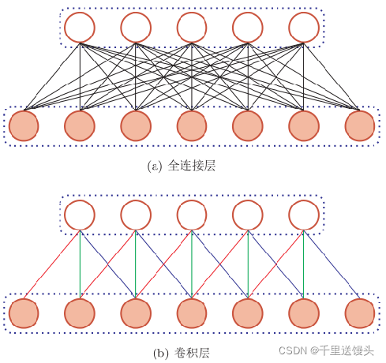

# 0.预备知识

​       对于初学者而言，开始学习GAN，但并不知道GAN是什么东西，认为GAN是一种高大上的东西。学完一问GAN的基本思想，不太清楚，反而将GAN给复杂化了，所以在这里我们要先引入一个简单的GAN的思想概念，在我们脑子中引入一个GAN的基本概念，可以帮助我们今后更好地学习。

GAN属于人工智能领域：通过对某一事物大量数据的学习，来学习总结出其在数学层面上的分布规律，构建出合理的映射函数，从而解决现实问题

什么是人工智能系统？
可以像人一样实现某些功能的机器或计算机
为什么要开发人工智能系统？
开发具有特定功能的人工智能系统用来为人类服务，因为有些功能人是没办法或很难实现的（如语音识别、人脸识别、围棋预测等）
人工智能系统具体如何来开发？
通过大量数据的学习来总结事物规律——构建映射函数
小栗子：直角三角形的规律的学习总结

1. 通过对大量三角形的学习，我们可以找到规律：有一个角为90°的三角形为直角三角形

2. 从而构建出直角三角形映射函数:输入x1=60°，x2=90°，x3=30°，输出为1；输入x1=70°，x2=60°，x3=50°，输出为0；

人工智能本质上是要构建数据的映射函数，而构建数据的映射函数需要通过一个学习归纳总结的过程，因此需要提供一个用于学习的模型，而生成对抗网络就是一种用来学习的模型 

# 1.GAN的介绍 

## 1.1 GAN的基本概念介绍

​      GAN的全称是Generative adversarial network，中文翻译过来就是生成对抗网络。生成对抗网络其实是两个网络的组合：生成网络(Generator)负责生成模拟数据；判别网络(Discriminator)负责判断输入的数据是真实的还是生成的。生成网络要不断优化自己生成的数据让判别网络判断不出来，判别网络也要优化自己让自己判断得更准确。二者关系形成对抗，因此叫对抗网络。

       这里的网络指的是神经网络，这是因为GAN是基于神经网络模型（以人类神经网络为原型提出的一种计算模型）设计的。关于神经网络模型的详细介绍，请参考神经网络简介和李永乐：卷积神经网络。至于为什么要用神经网络模型，而不用其他模型，是因为神经网络模型刚好适用于我们生成对抗网络的实现，并不是故意要选这种模型的，这点要搞清楚。

## 1.2 GAN的基本架构图

GAN网络架构概念图

GAN网络内部架构图

同我上面讲的一样，生成网络和判别网络都是神经网络的模式。

生成器(Generator)：通过机器生成数据（大部分情况下是图像），最终目的是“骗过”判别器。

判别器(Discriminator)：判断这张图像是真实的还是机器生成的，目的是找出生成器做的“假数据”。

# 2.一个GAN的形成过程

构建GAN模型的基本逻辑：现实问题需求→建立实现功能的GAN框架(编程)→训练GAN(生成网络、对抗网络)→成熟的GAN模型→应用。
本节主要是介绍“训练GAN”如何实现和其中的核心要点。

## 2.1训练GAN：生成网络和判别网络的训练 (优化)

​        GAN模型不是一上来就能实现具体功能的，需要经历一个训练的过程。我将其训练前后状态称为“原始的GAN模型”和“成熟的GAN模型”，原始的GAN模型要经过一个训练的过程成为一个成熟的GAN模型，而这个“成熟的GAN模型”才是我们实际应用的GAN模型。那么这个训练过程具体是训练什么呢？是训练生成网络(Generator)和判别网络(Discriminator)。训练是基于数据集训练的。

### 具体怎么训练的概念介绍：

​       这是一个生成器和判别器博弈的过程。生成器生成假数据，然后将生成的假数据和真数据都输入判别器，判别器要判断出哪些是真的哪些是假的。判别器第一次判别出来的肯定有很大的误差，然后我们根据误差来优化判别器。现在判别器水平提高了，生成器生成的数据很难再骗过判别器了，所以我们得反过来优化生成器，之后生成器水平提高了，然后反过来继续训练判别器，判别器水平又提高了，再反过来训练生成器，就这样循环往复，直到达到纳什均衡。更多详细内容请看一文看懂生成对抗网络——GANs。

### 具体怎么训练的原理介绍（数学层面）：

具体生成网络和对抗网络的优化是如何实现的? 继续往下走，这就涉及到两个核心的问题：神经网络的架构和损失函数 (loss function)。神经网络架构和损失函数的定义是能够实现优化（训练）的两个基本要素。

#### 1）神经网络架构

之前说了生成网络和对抗网络采用的都是神经网络的框架，也提到了是因为适合才选择神经网络的框架的，那么下面介绍一下为什么神经网络模型适合于事物分布规律的学习（成熟的GAN网络就是学习之后的GAN网络）。

一个简单的神经网络模型

        上图所示的就是生成器和判别器里面会采用的神经网络模型的一个最基础的形式展示 ，一般神经网络模型基本构成包含三个部分(由这三个部分组成)：输入层(Input Layer)、隐藏层(Hidden Layer)和输出层(Output Layer)组成。详细请参考：神经网络简介

输入层：只有一层，用于接收输入数据的特征X1 、X2……，然后原封不动输出给隐藏层，输入层不进行任何计算。
隐藏层：可以一层或多层，对上一层过来的数据进行处理然后输出给下一层，最终输出到输出层。f 指的是激活函数
输出层： 从隐藏层获取输入并执行计算，作为这些计算结果的计算值Y1 、Y2……，即输出。
相邻两层每两个神经元之间的的连线上都有权重（神经元j和神经元i之间的权重），优化的核心就是优化这些权重参数。怎么优化呢？首先就要引入损失函数，（损失函数相当于误差），有误差，根据误差反过来就可以调整参数(即神经网络优化的原理，又一重要概念，误差反向传播，往下看)。

#### 2）损失函数(loss function)

目的：损失函数(loss function)是用来估量模型的预测值与真实值的不一致程度（即误差）。更进一步了解请看：交叉熵损失函数。

生成网络的损失函数：

上式中，G 代表生成网络，D 代表判别网络，H 代表交叉熵，z 是输入随机数据。 是对生成数据的判断概率，1代表数据绝对真实，0代表数据绝对虚假。 代表判断结果与1的距离。显然生成网络想取得良好的效果，那就要做到，让判别器将生成数据判别为真数据（即D(G(z))与1的距离越小越好）。

判别网络的损失函数：

上式中，是真实数据，这里要注意的是，代表真实数据与1的距离，代表生成数据与0的距离。显然，识别网络要想取得良好的效果，那么就要做到，在它眼里，真实数据就是真实数据，生成数据就是虚假数据（即真实数据与1的距离小，生成数据与0的距离小）。

优化原理：生成网络和判别网络有了损失函数，就可以基于各自的损失函数，利用误差反向传播（Backpropagation）(BP)反向传播算法和最优化方法(如梯度下降法)来实现参数的调整），不断提高生成网络和判别网络的性能（最终生成网络和判别网络的成熟状态就是学习到了合理的映射函数）。

生成对抗网络的训练过程就是参数优化的过程。具体的优化案例介绍请看：
李永乐：机器学习与神经网络
https://www.ixigua.com/7009235244809191966?id=6937289753200951844&logTag=2a223eba9e10b68c3e5d

至此介绍GAN的部分就结束了， 下面的内容是我对在GAN中经常遇见的”卷积“概念进行简单的拓展讲解，有兴趣的朋友可以看一下。

   我们在学习中GAN时经常遇到“卷积”，对于一部分人来说，时常弄不清楚“卷积”与GAN之间的关系。下面我来介绍一下我理解的“卷积”和GAN之间的区别与联系。“卷积”在这里指的是卷积神经网络（我理解为在神经网络架构上利用卷积的原理来实现某种功能的一种特定神经网络架构），众所周知，卷积神经网络对于图像特征提取具有十分优异的性能，而很多GAN又都是跟图像有关系的（例如图像识别、图形转换等），因此卷积和神经网络就自然而然的结合了起来。

       神经网络不是一个狭义的网络连接形式，而是以神经元为基本单元，按需求进行设计出的神经网络的广义概念。比如，多层感知器网络、卷积神经网络、RNN网络、LSTM网络等。架构设计、权重参数设计、激活函数的等超参数的不同都会设计出各种各样的神经网络模型。它像是一块块积木，具体搭建出怎样的结构因每个人的想法而不同。

# 3.卷积神经网络(ConvNets)

卷积的操作就是提取图像特征，这些特征就是输入传统神经网络输入层的数据，也就是相当于在多层感知器网络的前面加一个卷积神经网络。

## 3.1卷积神经网络与传统多层神经网络

### 3.1.1卷积网络的结构

- 联系点：神经网络模型(neural networks)的基本组成包括输入层、隐藏层、输出层。而卷积神经网络的特点在于隐藏层分为卷积层和池化层(pooling layer，又叫下采样层)以及激活层。
- 卷积层：通过在原始图像上平移来提取特征
- 池化层：通过特征后稀疏参数来减少学习的参数，降低网络的复杂度，（最大池化和平均池化）
- 激活层：增加非线性分割能力
  如果是分类任务，还会加上一个全连接层(FC)也就是最后的输出层，进行损失计算分类，如果不是分类任务就不需要加。

区别1：传统网络层与层之间大都为全连接，而卷积层之间为如下连接

区别2：传统网络大多都是二维的，而卷积神经网络则是三维层面。

### 3.1.2卷积步骤

#### 一、卷积操作的介绍(概念层面)

LeNet 架构（1990 年代）

LeNet 是最早帮助推动深度学习领域的卷积神经网络之一。Yann LeCun 的这项开创性工作 在自 1988 年以来多次成功迭代后被命名为LeNet5。当时 LeNet 架构主要用于字符识别任务，例如读取邮政编码、数字等。

下面，我们将直观地了解 LeNet 架构如何学习识别图像，来了解卷积神经网络是如何工作的。

为了避免内容的繁杂，在此不做介绍了，详细的卷积步骤的介绍请看（十分通俗易懂）：
卷积神经网络的直观解释
https://ujjwalkarn.me/2016/08/11/intuitive-explanation-convnets/

#### 二、卷积的操作介绍(数学层面)

通过观察下图输入的特征图和特征图输出的内部机制，可以发现和传统的多层感知器很相似，只是前者的权重为一维数，而卷积层的权重为二维矩阵(卷积核)。

深度D是特征图的数量我认为，将下面右图的特征图旋转90°就是左图的长方体

 （224×224）是特征图大小，而64为特征图的数量

关于彩色图和灰度图的处理方式的不同
彩色图是由R、G、B三层矩阵，每个神经元带三个卷积核，最后输出为一个矩阵，即原本三层图像输入，然后输出为一层，该层即为特征图。

看下图的卷积层1，内置的卷积核为5×5×3，即为三层卷积核，6个卷积核。 

#  4.总结

## 1.生成网络和判别网络的网络架构

以深度卷积神将网络为例(DCGAN)
生成网络:卷积神经网络+反卷积神经网络(前者负责提取图像特征，后者负责根据输入的特征重新生成图像（即假数据）)。反卷积神经网络在此不做介绍，有兴趣的同学自行学习。
判别网络：卷积神经网络+全连接层处理(传统神经网络)(前者负责提取图像特征，后者负责判别真假。)

## 2.神经网络的基本概念

以神经元为基本单元，通过设置不同参数和设计不同形式而构成的网络模型。

## 3.GAN的核心要点

GAN的核心要点我觉得主要体现在GAN训练的核心上，即神经网络架构和损失函数基础下的误差反向传播。

## 4.卷积神经网络

卷积神经网络和GAN的关系:卷积神经网络对于处理图像相关的GAN来讲至关重要，是提取图像特征的重要工具；卷积神经网络与传统的多层感知器网络的对比；卷积神经网络的卷积操作的介绍。

